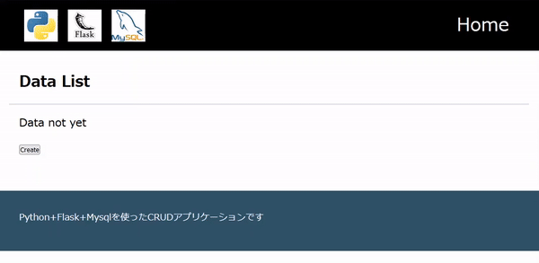

# flask-app
## 概要
学習目的で作成したWebアプリケーション。<br>
CRUD操作が可能な簡易画像データ管理システムです。<br>
Flaskを使用したバックエンドとMySQLを使用したデータベースを基盤として構築しています。<br>

---

## 主な機能

|機能|概要|
| :--- | :--- |
|データの追加|タイトル、画像データを入力してデータを追加します。<br>データ追加時に登録日時を自動記入|
|データの表示|一覧画面で登録されたデータを確認できます。<br>また、登録時の日次やデータ更新時の日時などの詳細を閲覧が可能です。|
|データの更新|各データに対して、個別に情報を更新することが可能です。<br>データ更新時に更新日時を自動記入|
|データの削除|不要になったデータを削除できます。|

---

## 使用技術

- **バックエンド**：Flask

- **データベース**：MySQL

- **テンプレートエンジン**：Jinja2

- **環境管理**：Poetry

- **バージョン管理**：Git/GitHub

---

## 動作環境

### Python
```bash
3.12以上
```
### Flask
```bash
3.0.3
```
### Jinja2
```bash
3.1.4
```
### MySQL Connector for Python
```bash
9.1.0
```
### python-dotenv
```bash
1.0.1
```
### データベース
- MySQL
```bash
8.0.32
```
---

## 基本起動方法

### 1. リポジトリをクローン
```bash
git clone https://github.com/tri050403/flask-app.git
cd flask-app
```
### 2. 必要パッケージインストール
必要なパッケージのインストール。

### 3. MySQLサーバの設定
MySQLの構築と本アプリケーション用のユーザおよびパスワードを作成。

### 4. 環境変数の設定
flaskr配下に.envファイルを作成し、環境変数を設定してください。<br>
以下を参考に記述してください。

| 環境変数       | 説明                            | 例                     |
| --------------- | ------------------------------- | ---------------------- |
| `DB_HOST`       | データベースのホスト名          | `localhost`           |
| `DB_USER`       | データベースのユーザー名        | `root`                |
| `DB_PASSWORD`   | データベースのパスワード        | `password`            |
| `DB_NAME`       | データベース名                 | `sample_db`           |
| `TABLE_NAME`    | テーブル名                     | `sample_table`           |
| `ALLOW_FILES`   | アップロード許可する拡張子リスト | `jpg,jpeg,png`        |


```bash
# 例
DB_HOST = "ホスト名"
DB_USER = "ユーザ名"
DB_PASSWORD = "パスワード"
DB_NAME = "データベース名"
TABLE_NAME = "テーブル名"
ALLOW_FILES = {'jpeg', 'jpg', 'png', 'gif'}
```

### 5. アプリケーションの起動

```bash
export FALSK_APP=flaskr
```

```bash
flask run
```

### 6. 動作確認
http://[host]:5000にアクセスし、アプリケーションの動作を確認

## 動作イメージ
